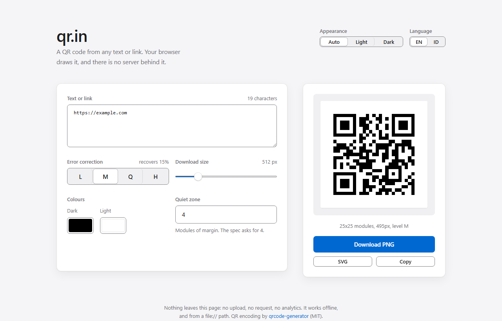
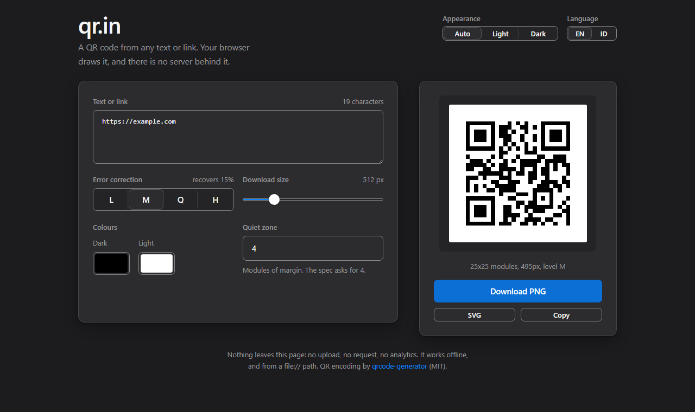

# qr.in

[](https://github.com/kevinpradith/qr.in/actions/workflows/ci.yml)
[](LICENSE)
[](THIRD-PARTY.md)

A QR code from any text or link, generated in the browser. No upload, no request,
no build step: open `index.html` and it works, including from a `file://` path.

**[qr-in.kevinpradith.my.id](https://qr-in.kevinpradith.my.id/)**



- Error correction L / M / Q / H
- Pixel size, quiet zone, and both colours
- Download PNG or SVG, or copy the image to the clipboard
- Auto / Light / Dark, and English / Bahasa Indonesia, both remembered
- The preview stays put while you type
- One breakpoint at 44rem: wider than that the controls and the preview sit side
  by side in a 1.618 : 1 split, narrower they stack. Gutters and the headline are
  clamped to the viewport rather than stepped, and a phone in landscape drops the
  strapline to get its vertical space back.

## Run it

Clone it, or download the source, and open the page. `index.html`, `app.js` and
`qrcode.js` are all it needs:

```sh
git clone https://github.com/kevinpradith/qr.in.git
cd qr.in
open index.html      # or xdg-open, or start, or just double-click it
```

There is nothing to install and nothing to build. Serving it over HTTP is
optional and only buys you the clipboard button, which browsers disable on
`file://`:

```sh
python3 -m http.server 8000
```

## Test

```sh
node test.js
```

One file, no framework, no dependencies. It loads `app.js` against a stub DOM and
checks the module grid, the pixel scaling, the SVG output, the UTF-8 encoding,
the wording in both languages, the reserved heights, and every colour pair
against WCAG. It prints `ok`, or it throws. CI runs the same command.

## Encoding

Two things the code does that a QR generator can get quietly wrong, so they are
worth stating:

- **Byte mode is UTF-8.** The vendored library defaults to
  `charCodeAt(i) & 0xff`, which truncates every character above U+00FF: an
  accent, an emoji or any non-Latin script would encode to a byte that decodes
  to something else. `app.js` swaps in the library's own UTF-8 encoder before
  encoding anything.
- **A module always lands on a whole pixel.** The requested download size is a
  ceiling, rounded down to a whole number of pixels per module and never below
  one, and the quiet zone is rounded as well as clamped. Half a pixel of offset
  is a blur to a scanner, not a smaller square. What you actually get is printed
  under the preview.

## Design

Every gap and type size comes from one ratio, φ = 1.618, declared as custom
properties at the top of the stylesheet. Change `--phi-4` and the page rescales.

### Type

Two ladders, because the page is half prose and half control panel. Prose runs
16 → 25.9 → 41.9px, which is 1rem stepped by φ twice, so the headline sizes come
off the same ratio as the spacing. Controls run at the macOS pair: 15px for
anything you type or press, 13px for the labels beside them. Measures are capped
at 66ch, the middle of Bringhurst's 45-75 characters.

### Theme and language

Both preferences are written to the root element by a blocking script in the
head, before the first paint, or the page would flash light-then-dark and
English-then-Indonesian on every load. Storage is wrapped in a `try`: some
privacy modes throw on it, and the preference is then good for one visit.

Three appearance states rather than two. A two-state toggle silently lies once
the OS switches theme by time of day, and there is then no way back to following
the system. "Auto" is the default and stores nothing meaningful, it just removes
the override.

Colours come from `light-dark()` pairs on one set of tokens, so `color-scheme`
is the only thing the control changes: no second palette block to drift out of
step, and no JavaScript involved in the switch itself.



The languages are named in their own language and each label carries its own
`lang`, so a screen reader pronounces "Bahasa Indonesia" in Indonesian. No flags:
a flag is a country, and a language is not. First visit follows
`navigator.language`.

Nothing on the page moves when the language changes, and it is measured rather
than assumed: the header is a two-column grid instead of a wrapping flex row,
and the preference segments are given fixed φ widths that hold the longest label
in either language. The language control shows ISO codes for the same reason,
with the native name on `aria-label` and `title`. To re-measure after a change,
append a script that prints `getBoundingClientRect()` for `#themeSeg`, `.prefs`,
`.layout` and `#png` into `document.title`, then compare the two languages:

    chrome --headless=new --dump-dom index.html

The one message that differs enough in length to wrap, "too much text for one QR
code", is measured the same way. It takes two lines at every width below about
700px, and in Indonesian at around 900px, so `#error` reserves two lines
(`min-height: 3.236em`) and its box is the same height empty as it is full.
Reserving one line let the preview jump down the moment the text stopped
fitting. `test.js` asserts the reservation.

### Colour

Every pair the page draws is checked by `test.js` against WCAG 2.2: 4.5:1 for
text (1.4.3), 3:1 for the edge of a control and for the focus ring (1.4.11). Two
consequences worth knowing before editing the palette:

- Control borders are `#86868b`, not a hairline. Apple's own hairline is 1.4:1
  against white, and the edge of a text box is the only thing saying where it is.
  Card edges, which say nothing, keep the hairline.
- There are two blues. `--accent` is a fill with white text on it; `--accent-text`
  is the one read as text or drawn as a line. In dark mode they differ, because
  white on Apple's `#0a84ff` is 3.65:1 and `#0a84ff` on the dark background is
  4.66:1, so neither blue can do both jobs.

Targets are at least 42px, over the 24px WCAG 2.5.8 asks for; the slider's hit
area is the full 42px box rather than the 20px knob.

### Surface

The surface treatment is macOS: San Francisco through the system font stack,
hairline borders instead of grey ones, controls on white cards over a grey
desktop, a segmented control for the correction level, and the system accent
blue used only for focus and the primary action.

## Files

| File | What it is |
| --- | --- |
| `index.html` | The page: markup, the whole stylesheet, and the blocking script that applies the saved preferences before the first paint. |
| `app.js` | Encoding, canvas drawing, SVG output, downloads, and the English and Indonesian strings. |
| `qrcode.js` | [qrcode-generator](https://github.com/kazuhikoarase/qrcode-generator) 1.4.4, MIT, vendored so the page works offline. Not edited. |
| `test.js` | The whole check. `node test.js`. |

## Hosting

Static files. Any static host, or none at all: the page is designed to be opened
from disk, and nothing on it needs an origin. There is no build command and no
output directory to configure, so a host that insists on a framework wants
"other", an empty build step, and the repository root.

The hosted copy is at <https://qr-in.kevinpradith.my.id/>, on Vercel.

## Privacy

Nothing leaves the page. There is no upload, no request at runtime, no analytics
and no telemetry, which is why the library is vendored rather than pulled from a
CDN. `localStorage` holds two keys, `qr.in:theme` and `qr.in:lang`, and nothing
else is stored anywhere.

## Contributing

Issues and pull requests are welcome. See [CONTRIBUTING.md](CONTRIBUTING.md) for
what to keep in mind, and the [code of conduct](CODE_OF_CONDUCT.md).

## Licence

[MIT](LICENSE). The one vendored dependency is MIT as well, with its notice in
[THIRD-PARTY.md](THIRD-PARTY.md).
